# Block20 Gym Management System — Design Class Diagrams (GRASP-driven)

---

## UC1: Manage Member Profiles

### enterMemberDetails

**GRASP Patterns Applied**:
- **Controller**: MemberController handles system operation
- **Information Expert**: ValidationService validates data; DuplicateCheckService checks duplicates
- **Creator**: MemberRepository creates and stores Member (contains/records members)
- **Pure Fabrication**: ValidationService, DuplicateCheckService, IDGenerationService, MemberCardService, AuditService

### selectManageMembers

### chooseCreateNewMember

---

## UC2: Process Member Enrollment

### activateMembership

**GRASP Patterns Applied**:
- **Controller**: EnrollmentController handles system operation
- **Information Expert**: MemberRepository retrieves member; PlanRepository retrieves plan; PricingService calculates fees
- **Creator**: EnrollmentRepository creates Enrollment; CredentialsService creates credentials
- **Pure Fabrication**: PricingService, PaymentService, CredentialsService, WelcomeService

### generateMembershipAgreement

### submitSignedAgreement

### enterPaymentInfo

*See UC4 processPayment for detailed payment flow*

---

## UC3: Handle Membership Renewals

### processRenewal

**GRASP Patterns Applied**:
- **Controller**: RenewalController handles system operation
- **Information Expert**: MemberRepository finds member; PricingService calculates renewal fees
- **Creator**: RenewalRepository creates Renewal
- **Pure Fabrication**: PricingService, PaymentService, CardService, NotificationService

---

## UC4: Process Member Payments

### processPayment

**GRASP Patterns Applied**:
- **Controller**: PaymentController handles system operation
- **Information Expert**: MemberRepository finds member; BillingItemService retrieves outstanding items
- **Creator**: TransactionRepository creates transaction records
- **Pure Fabrication**: BillingItemService, DiscountService, TotalsService, PaymentService, NotificationService
- **Indirection/Protected Variations**: IPaymentGateway interface

---

## UC5: Generate Financial Reports

### generateReport

**GRASP Patterns Applied**:
- **Controller**: ReportingController handles system operation
- **Information Expert**: TransactionRepository retrieves transaction data
- **Creator**: ReportFormatter creates FinancialReport
- **Pure Fabrication**: AggregationService, ChartService, ReportFormatter
- **High Cohesion**: Each service has single focused responsibility

### exportReport

---

## UC6: Track Member Access

### presentIdentification / exitFacility

**GRASP Patterns Applied**:
- **Controller**: AccessController handles system operations
- **Information Expert**: MemberRepository finds member; AccessPolicyService verifies access
- **Creator**: AttendanceRepository creates/updates AttendanceRecord
- **Pure Fabrication**: AccessPolicyService, OccupancyService
- **Indirection**: AccessControlProxy for hardware

---

## UC7: Monitor Gym Operations

### retrieveRealTimeData / generateDailyReport / metrics

**GRASP Patterns Applied**:
- **Controller**: OperationsController handles system operations
- **Information Expert**: Various services provide specialized operational data
- **Pure Fabrication**: OccupancyService, EquipmentUtilizationService, StaffAttendanceService, TrendAnalysisService, MetricsService, OperationsReportService
- **High Cohesion**: Each service handles a specific operational aspect

```mermaid
classDiagram
    class OperationsController {
        -occupancyService: OccupancyService
        -equipmentService: EquipmentUtilizationService
        -staffService: StaffAttendanceService
        -trendService: TrendAnalysisService
        -metricsService: MetricsService
        -reportService: OperationsReportService
        +retrieveRealTimeData() OpsSnapshot
        +generateDailyReport() OperationalReport
        +retrievePeakUsageHours() PeakHours
        +retrieveHourlyTrends() Trends
        +retrieveUsagePatterns(period) UsagePatterns
        +retrieveEquipmentZoneUtilization() ZoneUtilization
        +retrieveStaffAttendance() StaffCoverage
        +retrieveOperationalMetrics() Metrics
    }
    
    class OccupancyService {
        +getCurrentOccupancy() Occupancy
    }
    
    class Occupancy {
        -current: int
        -capacity: int
        -percentage: float
    }
    
    class EquipmentUtilizationService {
        +getZoneUtilization() ZoneUtilization
    }
    
    class ZoneUtilization {
        -zoneData: Map
        -timestamp: DateTime
    }
    
    class StaffAttendanceService {
        +getCoverage() StaffCoverage
    }
    
    class StaffCoverage {
        -onDuty: int
        -scheduled: int
        -coverage: float
    }
    
    class TrendAnalysisService {
        +getPeakHours() PeakHours
        +getHourlyVisitTrends() Trends
        +getUsagePatterns(period: Period) UsagePatterns
    }
    
    class PeakHours {
        -hours: List
        -data: Map
    }
    
    class Trends {
        -hourlyData: Map
    }
    
    class UsagePatterns {
        -patterns: Map
        -period: Period
    }
    
    class MetricsService {
        +getKeyMetrics() Metrics
    }
    
    class Metrics {
        -data: Map
    }
    
    class OperationsReportService {
        +compileDaily() OperationalReport
    }
    
    class OperationalReport {
        -reportID: String
        -date: Date
        -metrics: Metrics
        -summary: String
    }
    
    class OpsSnapshot {
        -occupancy: Occupancy
        -zones: ZoneUtilization
        -staff: StaffCoverage
        -timestamp: DateTime
    }
    
    OperationsController "1" --> "1" OccupancyService : uses
    OperationsController "1" --> "1" EquipmentUtilizationService : uses
    OperationsController "1" --> "1" StaffAttendanceService : uses
    OperationsController "1" --> "1" TrendAnalysisService : uses
    OperationsController "1" --> "1" MetricsService : uses
    OperationsController "1" --> "1" OperationsReportService : uses
```

---

## UC8: Manage Trainer Operations

### registerTrainer

**GRASP Patterns Applied**:
- **Controller**: TrainerController handles system operation
- **Information Expert**: CertificationValidationService validates certifications
- **Creator**: TrainerRepository creates Trainer; AuthService creates Credentials
- **Pure Fabrication**: CertificationValidationService, DocumentStorage, ScheduleService, AuthService, NotificationService

---

## UC9: Schedule Personal Training Sessions

### createSession

**GRASP Patterns Applied**:
- **Controller**: SchedulingController handles system operation
- **Information Expert**: MemberRepository finds member; AvailabilityService checks trainer availability; PricingService calculates pricing
- **Creator**: SessionRepository creates TrainingSession
- **Pure Fabrication**: AvailabilityService, PricingService, PaymentService, NotificationService

---

## UC10: Manage Equipment Inventory

### addEquipment

**GRASP Patterns Applied**:
- **Controller**: InventoryController handles system operation
- **Information Expert**: EquipmentRepository knows how to create Equipment
- **Creator**: EquipmentRepository creates Equipment; EquipmentIDGenerator creates IDs
- **Pure Fabrication**: EquipmentIDGenerator, DocumentStorage, WarrantyService, InventoryService

---

## UC12: Process Overdue Accounts

### generateAndSendReminder

**GRASP Patterns Applied**:
- **Controller**: AccountsReceivableController handles system operation
- **Information Expert**: AccountsRepository retrieves account information; LateFeeService calculates fees
- **Creator**: OverdueLogRepository creates communication records
- **Pure Fabrication**: LateFeeService, NotificationService, OverdueLogRepository

### suspendMemberAccess

---

## UC15: Manage System Configuration

### modifySettings

**GRASP Patterns Applied**:
- **Controller**: ConfigurationController handles system operation
- **Information Expert**: ConfigRepository retrieves and persists settings
- **Creator**: ConfigRepository creates/updates Settings
- **Pure Fabrication**: ValidationEngine, AuditLogService, NotificationService
- **Protected Variations**: Settings abstraction shields from implementation changes

---

