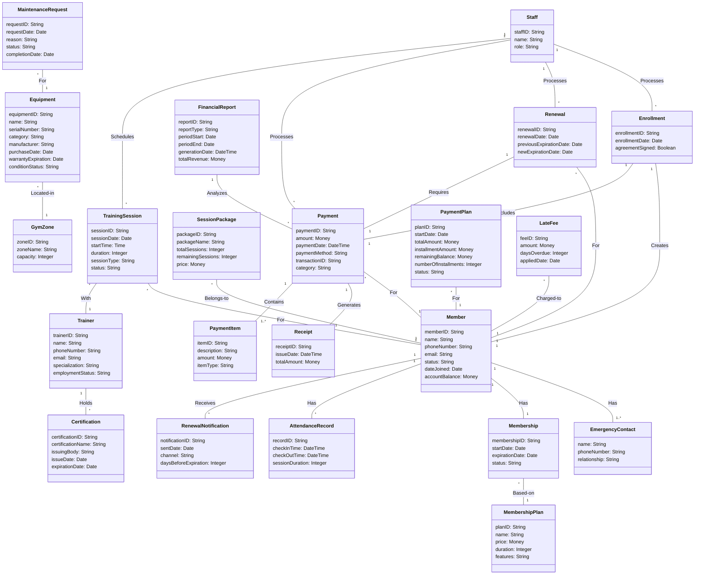

# Block20 Gym Management System - Domain Model

**Unified Domain Model** (Use Cases 1-12, 15)

**Core Classes:** Member, Staff, Trainer, MembershipPlan, Membership, Payment, Enrollment, Renewal, EmergencyContact, Receipt, PaymentItem, RenewalNotification, FinancialReport, AttendanceRecord, TrainingSession, SessionPackage, Equipment, GymZone, MaintenanceRequest, Certification, PaymentPlan, LateFee

---

## Use Case Coverage

- **UC1 (Manage Member Profiles):** Member, Staff, EmergencyContact
- **UC2 (Process Member Enrollment):** Enrollment, MembershipPlan, Payment
- **UC3 (Handle Membership Renewals):** Membership, Renewal, RenewalNotification
- **UC4 (Process Member Payments):** Payment, Receipt, PaymentItem
- **UC5 (Generate Financial Reports):** FinancialReport
- **UC6 (Manage Member Check-in/Check-out):** AttendanceRecord
- **UC7 (Monitor Gym Operations):** _(No new domain classes - monitoring/reporting)_
- **UC8 (Manage Trainer Operations):** Trainer, Certification
- **UC9 (Schedule Personal Training Sessions):** TrainingSession, SessionPackage
- **UC10 (Manage Equipment Inventory):** Equipment, GymZone, MaintenanceRequest
- **UC12 (Process Overdue Accounts):** PaymentPlan, LateFee
- **UC15 (Manage System Configuration):** _(No domain classes - software configuration)_

---