# Block20 Gym Management System - System Sequence Diagrams

## UC1: Manage Member Profiles (Main Success Scenario)

**Actor:** Administrator  
**System Events:** selectManageMembers, chooseCreateNewMember, enterMemberDetails

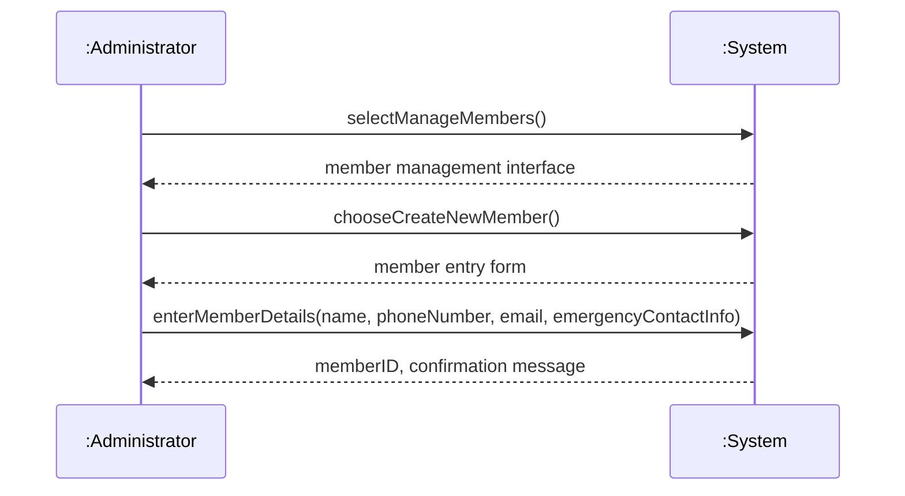

---

## UC2: Process Member Enrollment (Main Success Scenario)

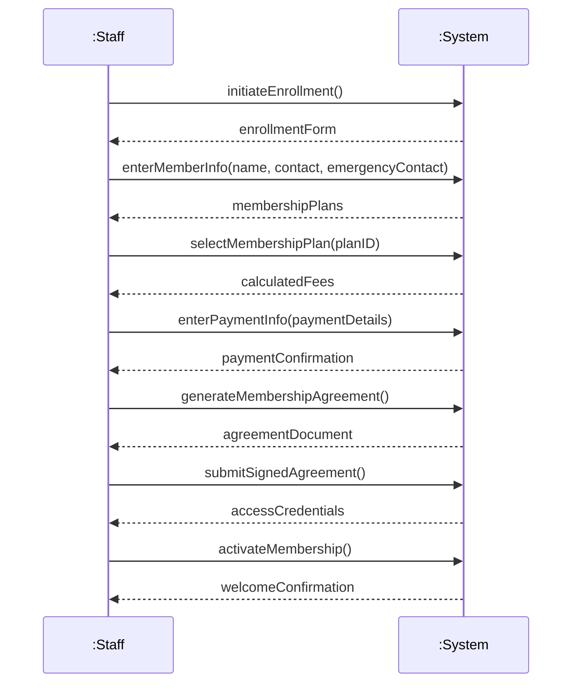

---

## UC3: Handle Membership Renewals (Main Success Scenario)

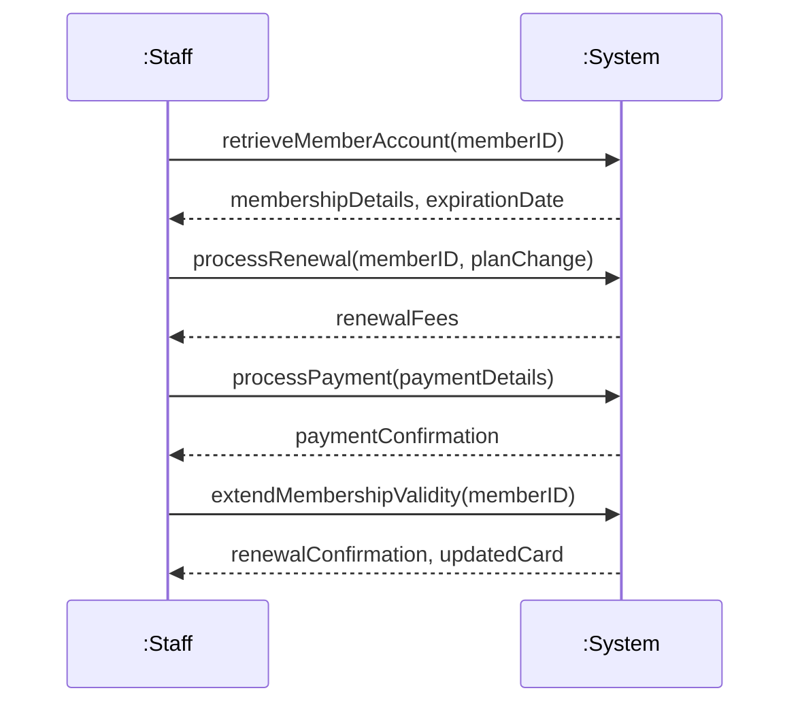

---

## UC4: Process Member Payments (Main Success Scenario)

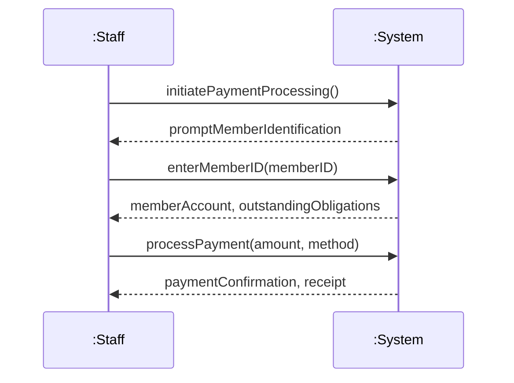

---

## UC5: Generate Financial Reports (Main Success Scenario)

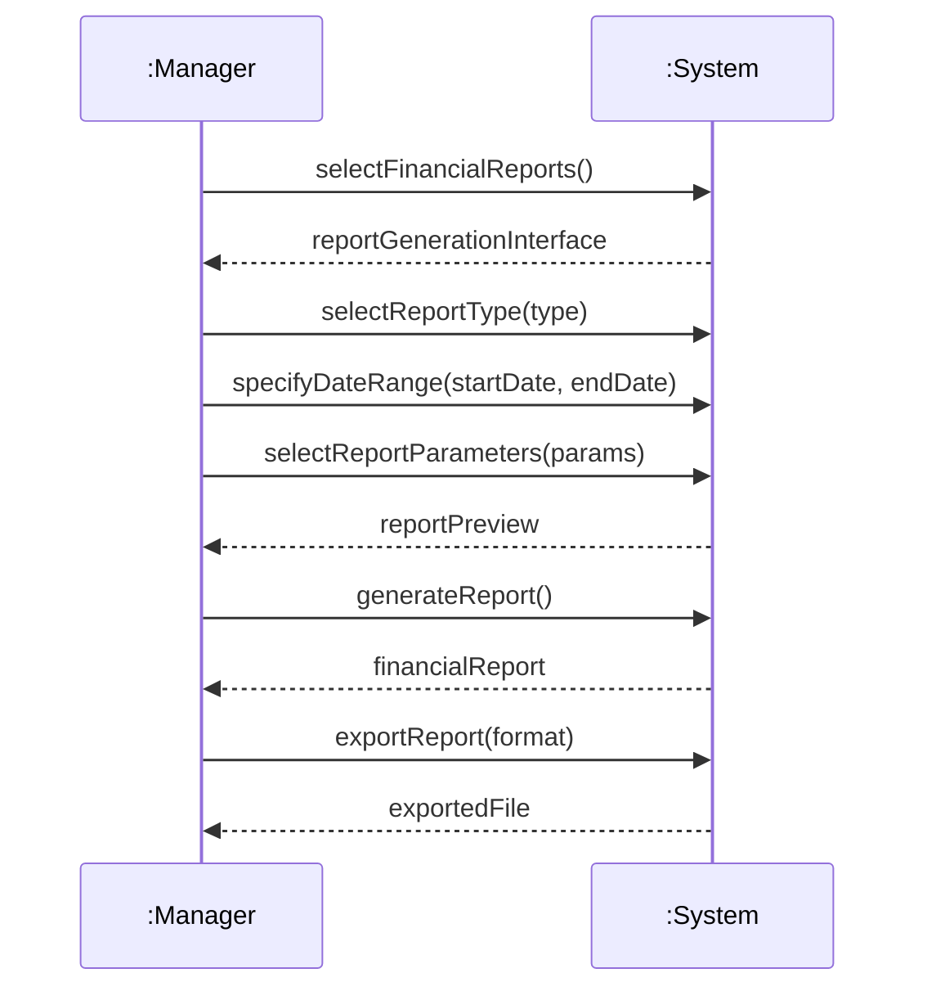

---
## UC6: Track Member Access (Main Success Scenario)

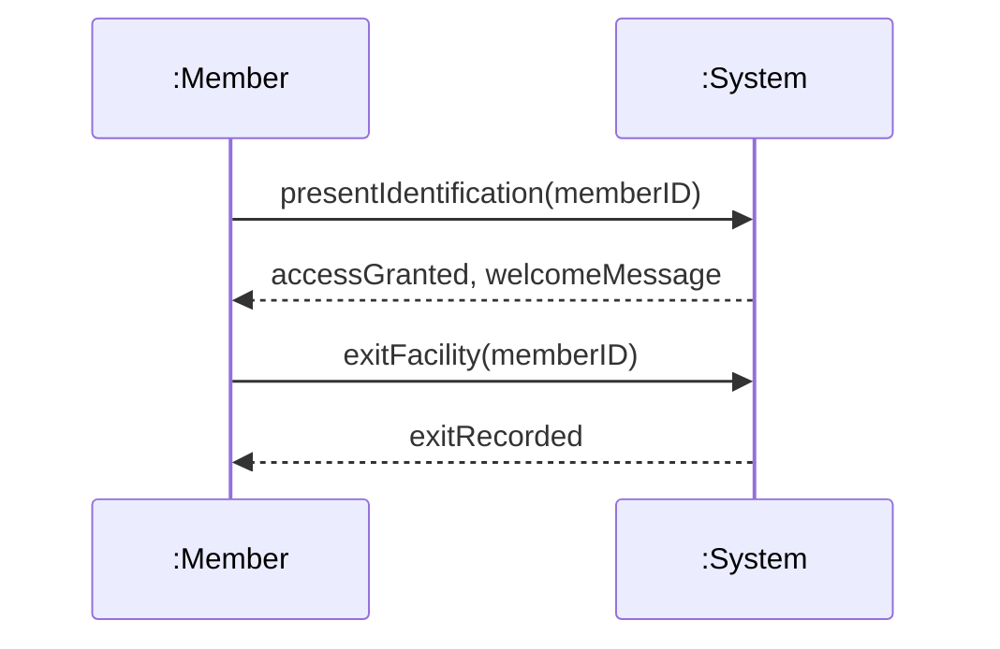

---

## UC7: Monitor Gym Operations (Main Success Scenario)

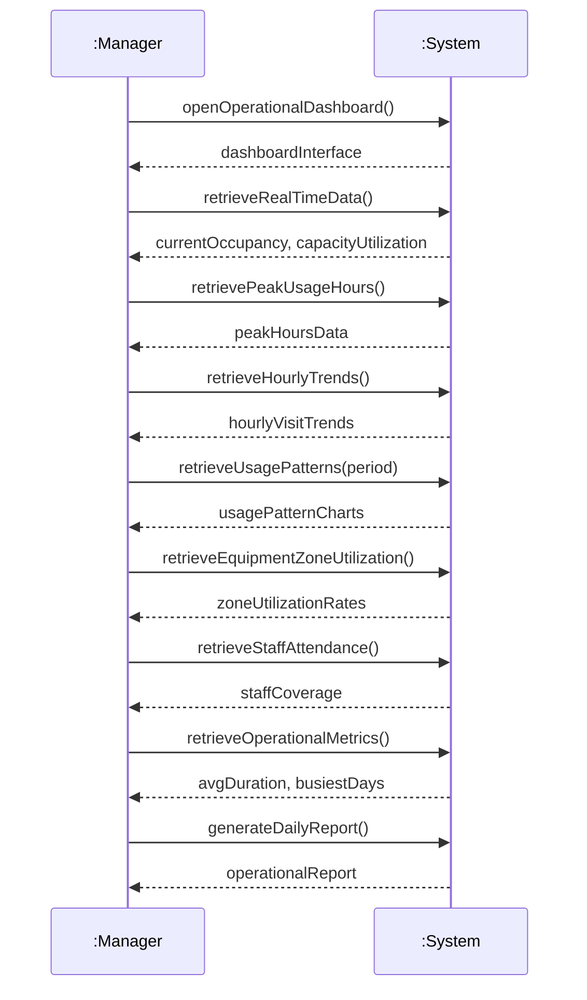

---

## UC8: Manage Trainer Operations (Main Success Scenario)

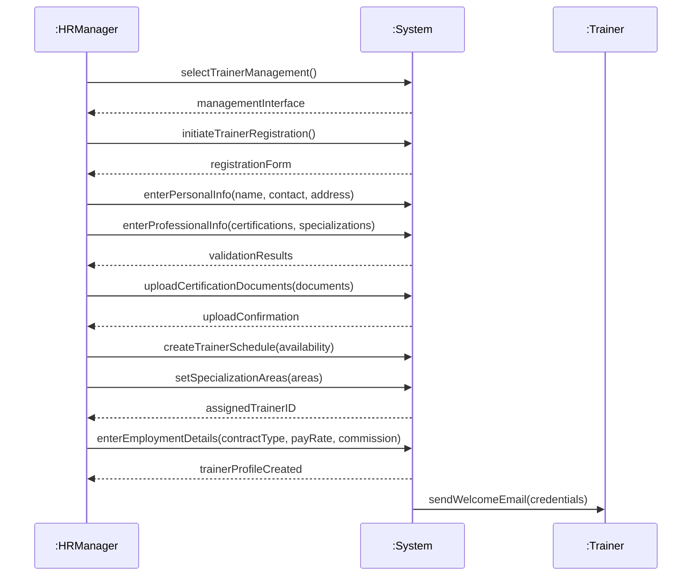

---

## UC9: Schedule Personal Training Sessions (Main Success Scenario)

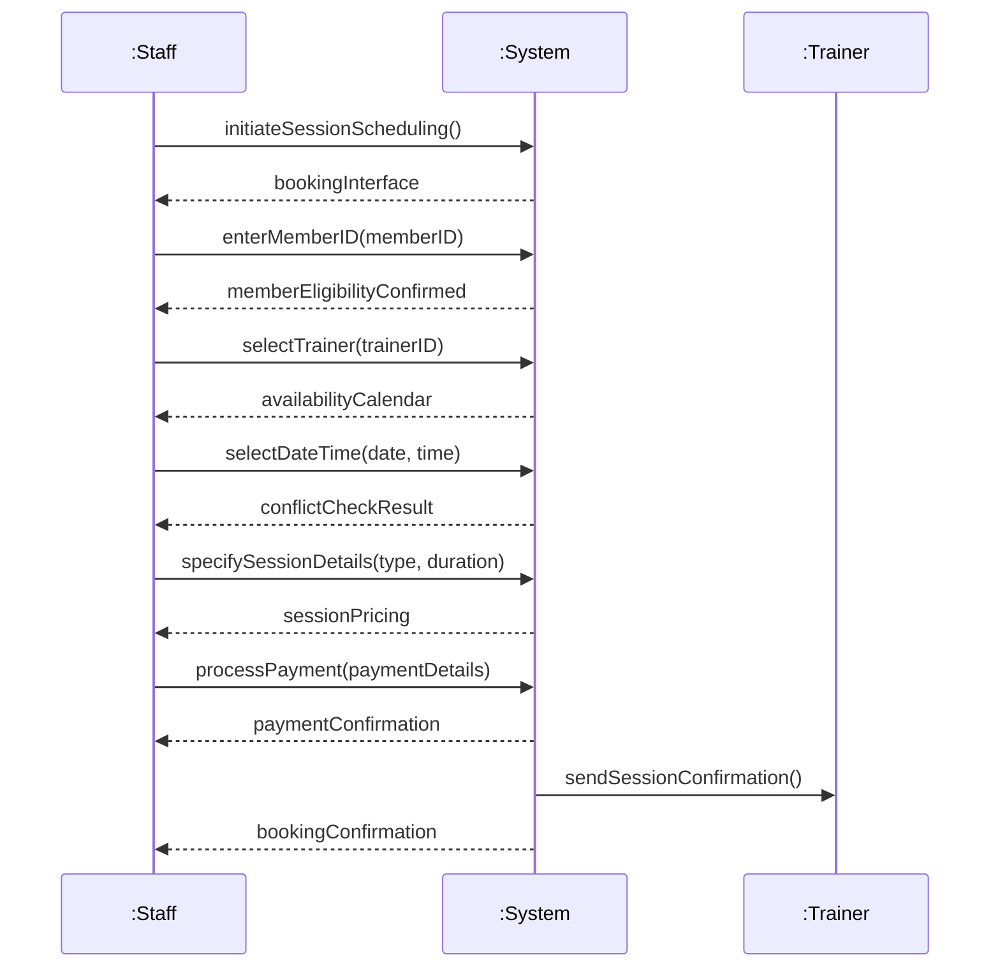

---

## UC10: Manage Equipment Inventory (Main Success Scenario)

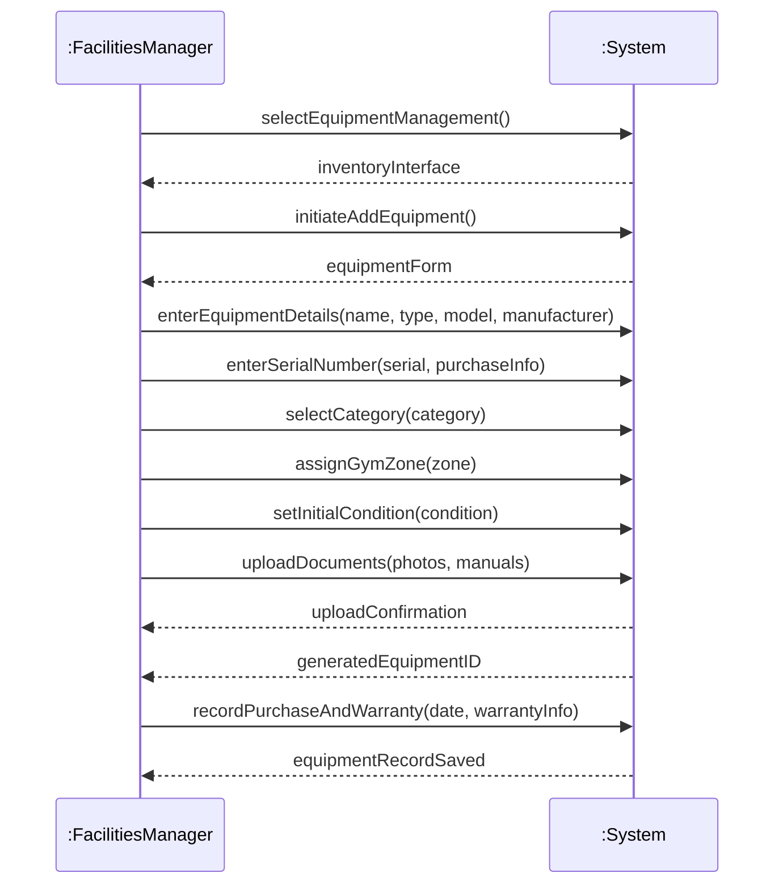

---

## UC12: Process Overdue Accounts (Main Success Scenario)

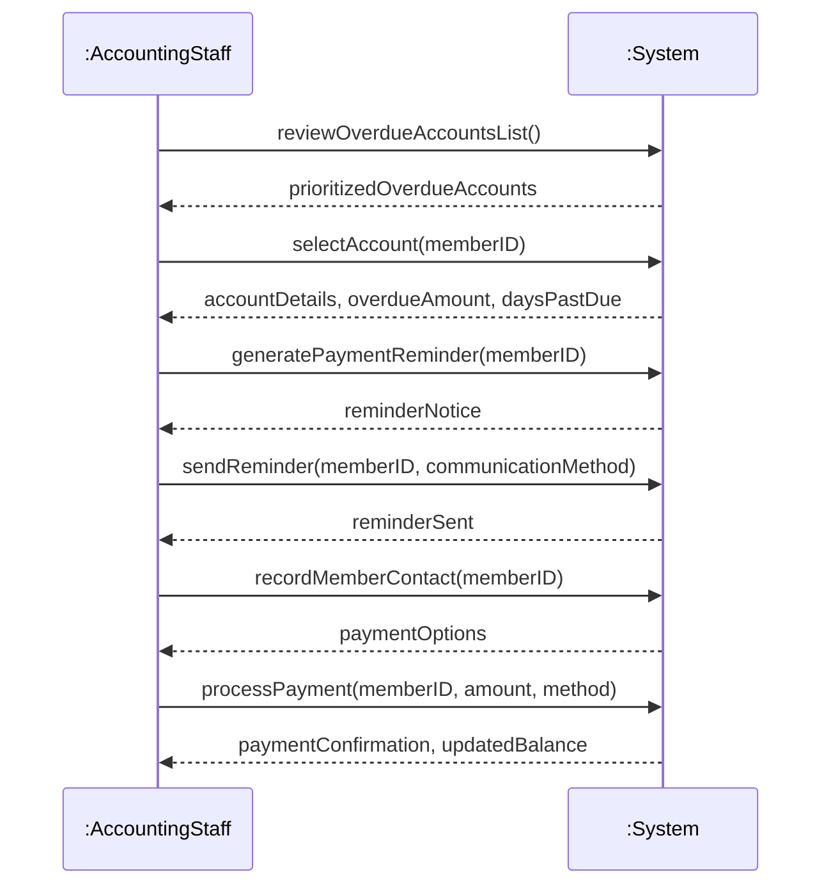

---

## UC15: Manage System Configuration (Main Success Scenario)

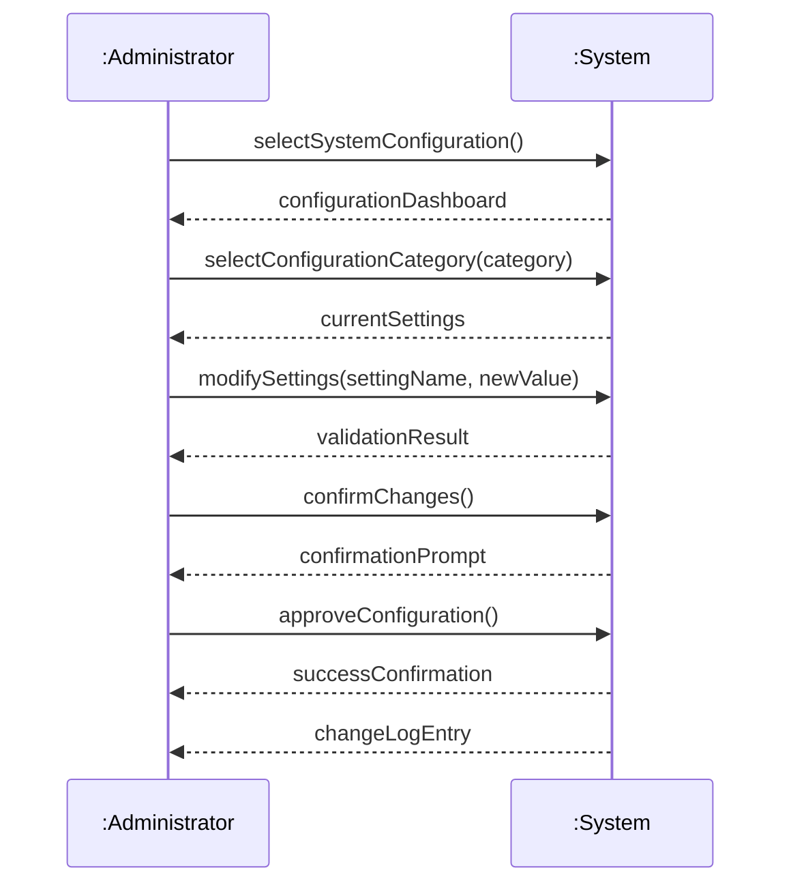

---
