# Block20 Gym Management System — Detailed Sequence Diagrams (Design)

These detailed sequence diagrams are derived from the System Sequence Diagrams in `SSD.md` and follow the rules in `.github/instructions/detailed-sd-rules.md`. They show internal object collaborations for the main success scenarios. Naming uses abstract, intention-level verbs and domain vocabulary.

---

## UC1: Manage Member Profiles — enterMemberDetails

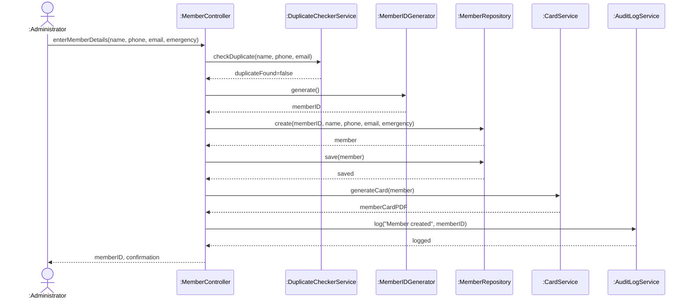

---

## UC1: Manage Member Profiles — chooseCreateNewMember

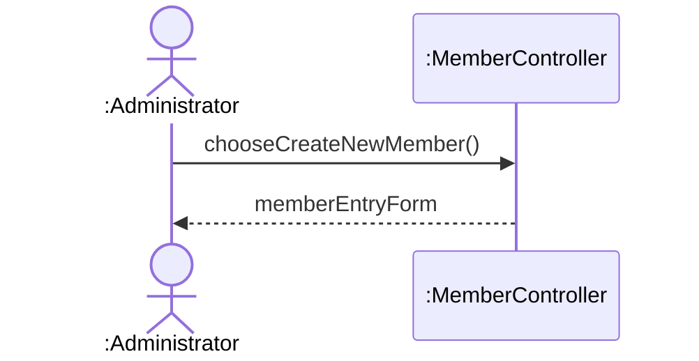

---

## UC2: Process Member Enrollment — activateMembership

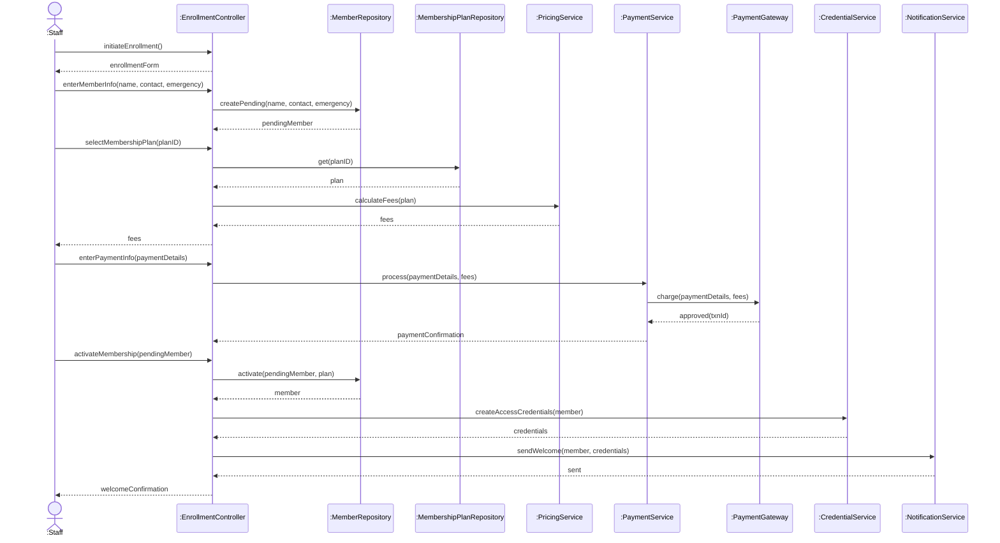

---

## UC3: Handle Membership Renewals — processRenewal

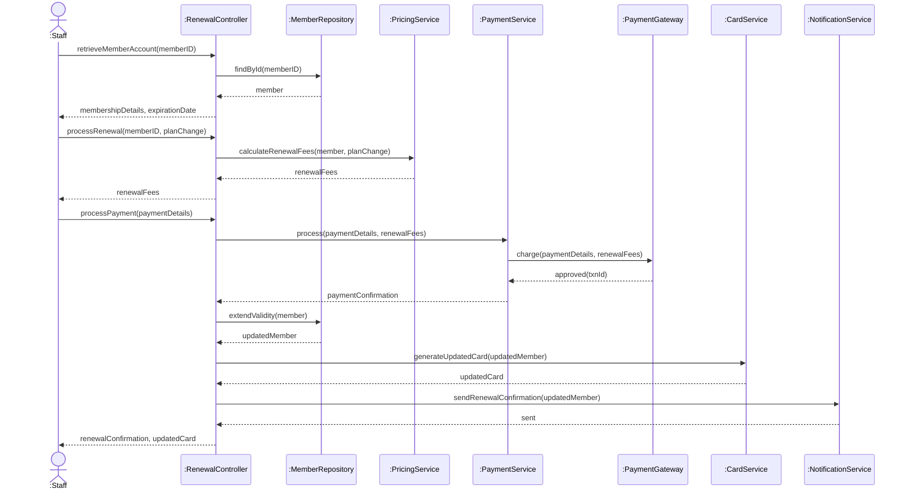

---

## UC4: Process Member Payments — processPayment

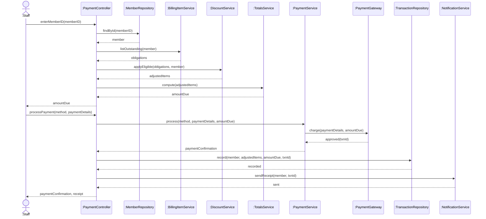

---

## UC5: Generate Financial Reports — generateReport

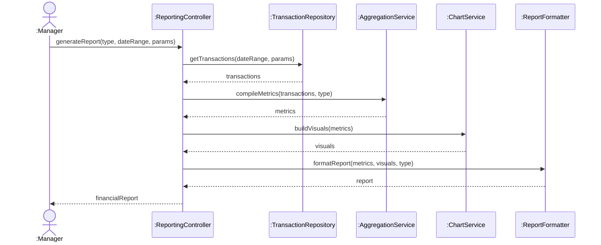

---

## UC5: Generate Financial Reports — exportReport

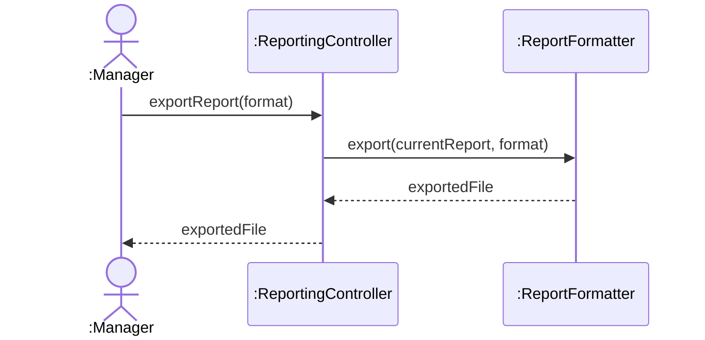

---

## UC6: Track Member Access — presentIdentification

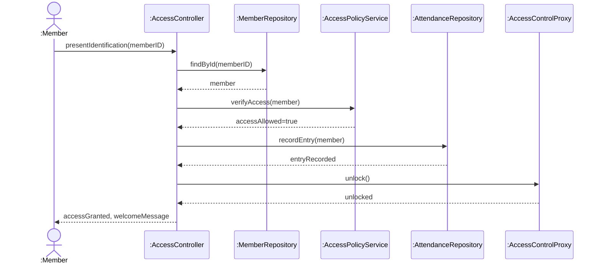

---

## UC7: Monitor Gym Operations — retrieveRealTimeData

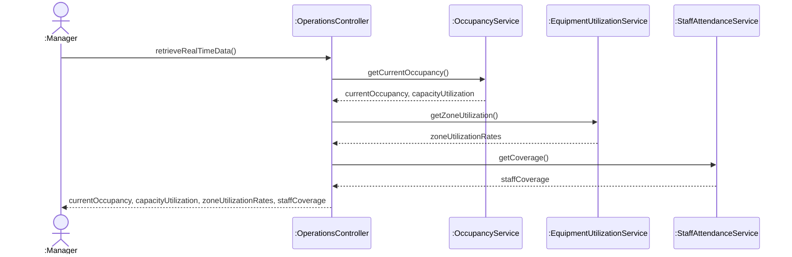

---

## UC7: Monitor Gym Operations — generateDailyReport

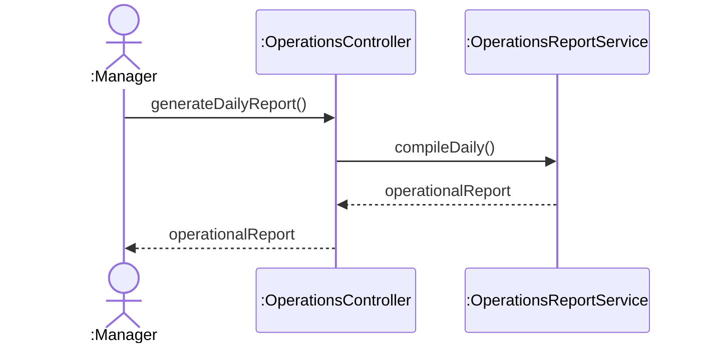

---

## UC7: Monitor Gym Operations — retrievePeakUsageHours

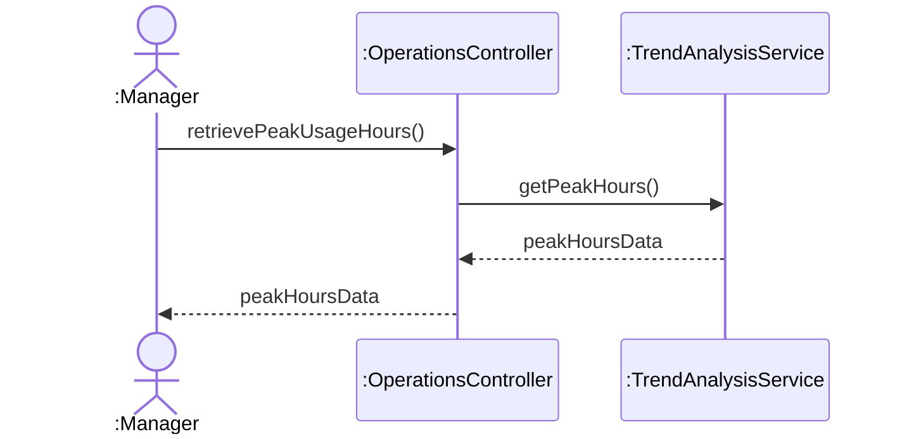

---

## UC7: Monitor Gym Operations — retrieveOperationalMetrics

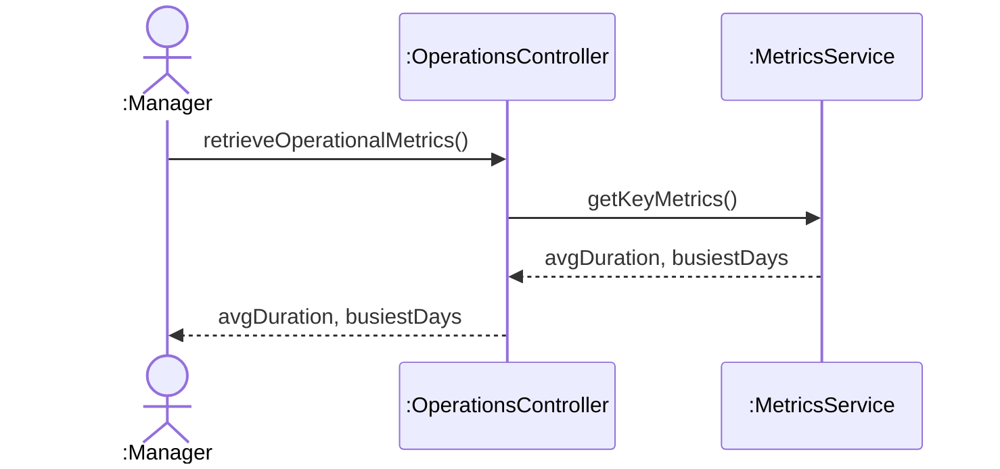

---

## UC8: Manage Trainer Operations — registerTrainer

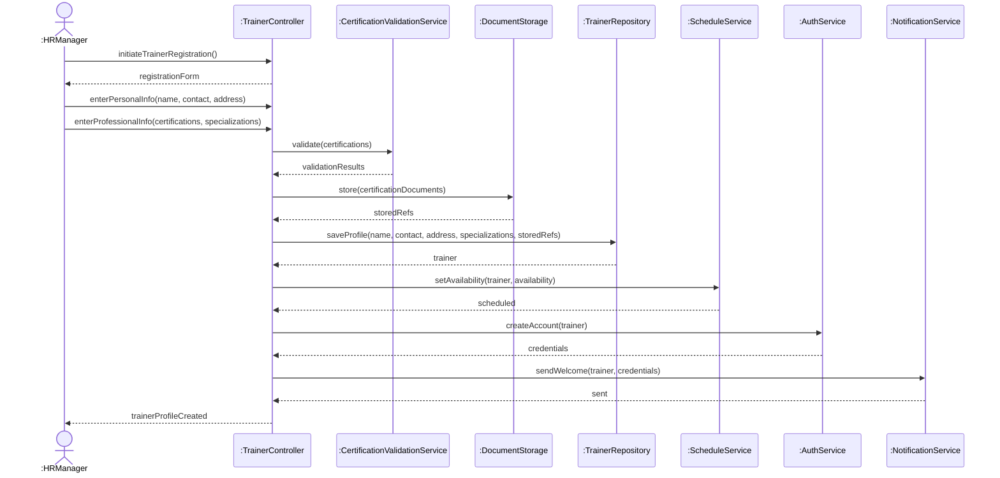

---

## UC9: Schedule Personal Training Sessions — createSession

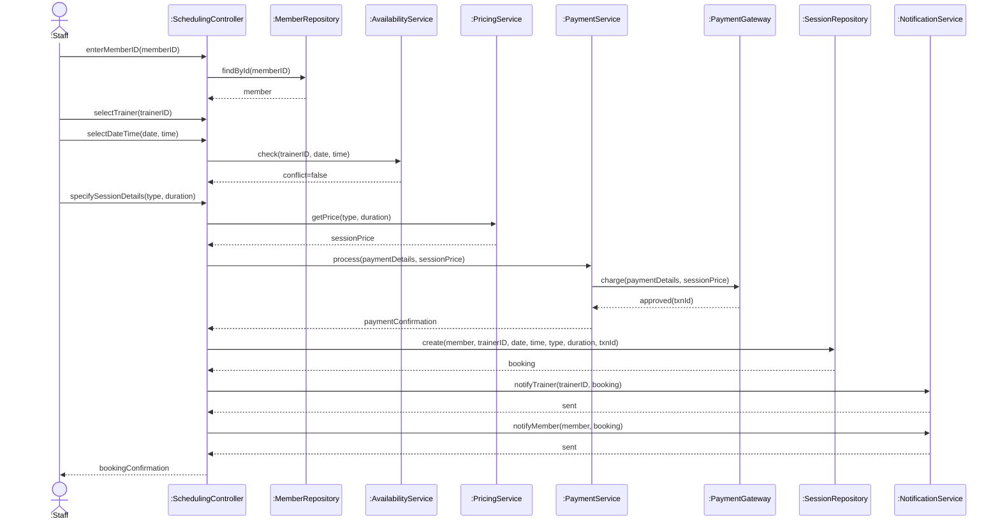

---

## UC10: Manage Equipment Inventory — addEquipment

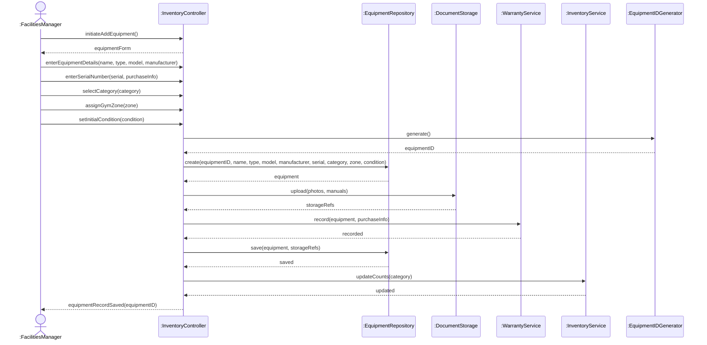

---

## UC12: Process Overdue Accounts — generateAndSendReminder

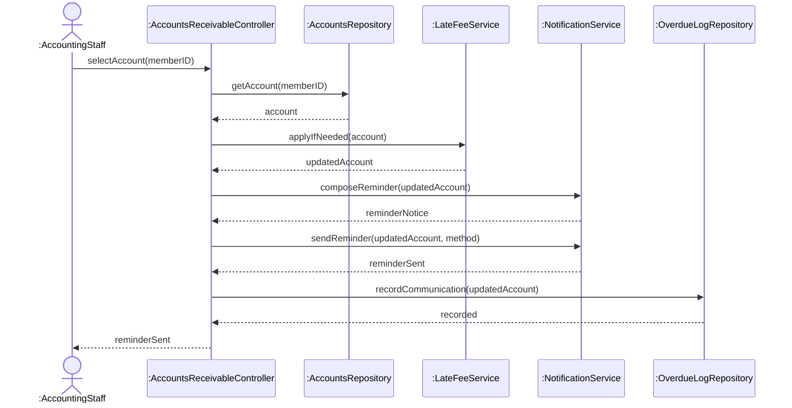

---

## UC12: Process Overdue Accounts — processPayment (reference)

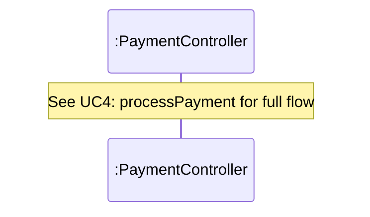

---

## UC15: Manage System Configuration — modifySettings

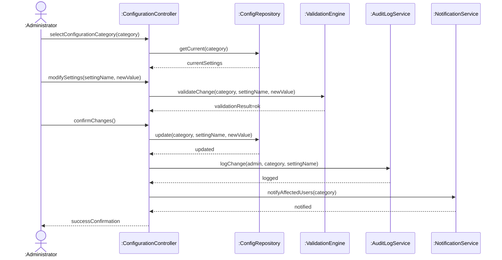

---

